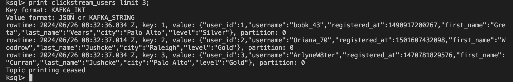
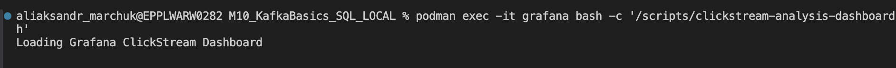

# Kafka Basics

Link to project repo - https://github.com/Mamba369x/M10_KafkaBasics_SQL_LOCAL

## Example Usage

* Step 0: To learn basic Kafka operations, proceed with quickstart guide (STEPS 1-5):

Build project using Gradle:
- ./gradlew jar -PscalaVersion=2.13.12

Run Zookeper and Kafka server:
- bin/zookeeper-server-start.sh config/zookeeper.properties
- bin/kafka-server-start.sh config/server.properties


- bin/kafka-topics.sh --create --topic quickstart-events --bootstrap-server localhost:9092

Create topic quickstart-events:


Produce and read events from newly created topic.
- bin/kafka-console-producer.sh --topic quickstart-events --bootstrap-server localhost:9092
- bin/kafka-console-consumer.sh --topic quickstart-events --from-beginning --bootstrap-server localhost:9092


* Step 1: To install **kafka-connect-datagen** and **kafka-connect-elasticsearch** following command should be used on Mac:

```bash
podman run -v "$(pwd)/confluent-hub-components:/usr/share/confluent-hub-components" cnfldemos/cp-server-connect-datagen:0.6.0-7.2.1 sh -c "confluent-hub install --no-prompt confluentinc/kafka-connect-elasticsearch:10.0.2 && confluent-hub install --no-prompt confluentinc/kafka-connect-datagen:0.4.0"
```


* Step 2: Compose Docker containers

```bash
podman-compose up -d
```


* Step 3: Check containers statuses

```bash
podman-compose ps
```


* Step 4: Run ksql console

```bash
podman exec -it ksqldb-cli ksql http://ksqldb-server:8088
```


* Step 5: Create connectors

```ksql
RUN SCRIPT '/scripts/create-connectors.sql';
```


* Step 6: Validate data from stream

```ksql
print clickstream_users limit 3;
```



* Step 7: Check running connectors


* Step 8: Create and load streaming data

```ksql
RUN SCRIPT '/scripts/statements.sql';
```


* Step 9-10: Verify data and ongoing streaming flow


* Step 11: Run ElasticSeach mapping template setup

```bash
podman exec -it elasticsearch bash -c '/scripts/elastic-dynamic-template.sh'
```


* Step 12: Connect ksqlDB tables to Elasticsearch and Grafana

```bash
podman exec -it ksqldb-server bash -c '/scripts/ksql-tables-to-grafana.sh'
```


* Step 13: Load dashboards

```bash
podman exec -it grafana bash -c '/scripts/clickstream-analysis-dashboard.sh'
```



* Step 14-17: Sessionize data and oberve results in Grafana and Confluent Control Center

```bash
./sessionize-data.sh
```


